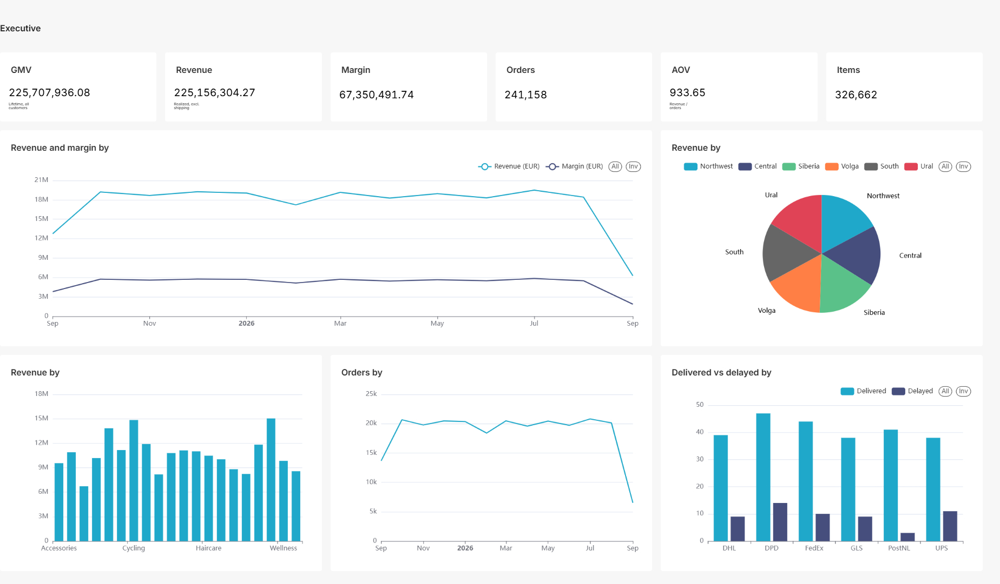
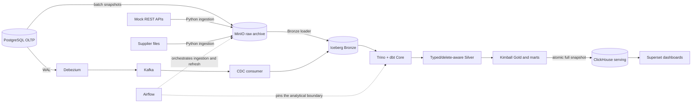
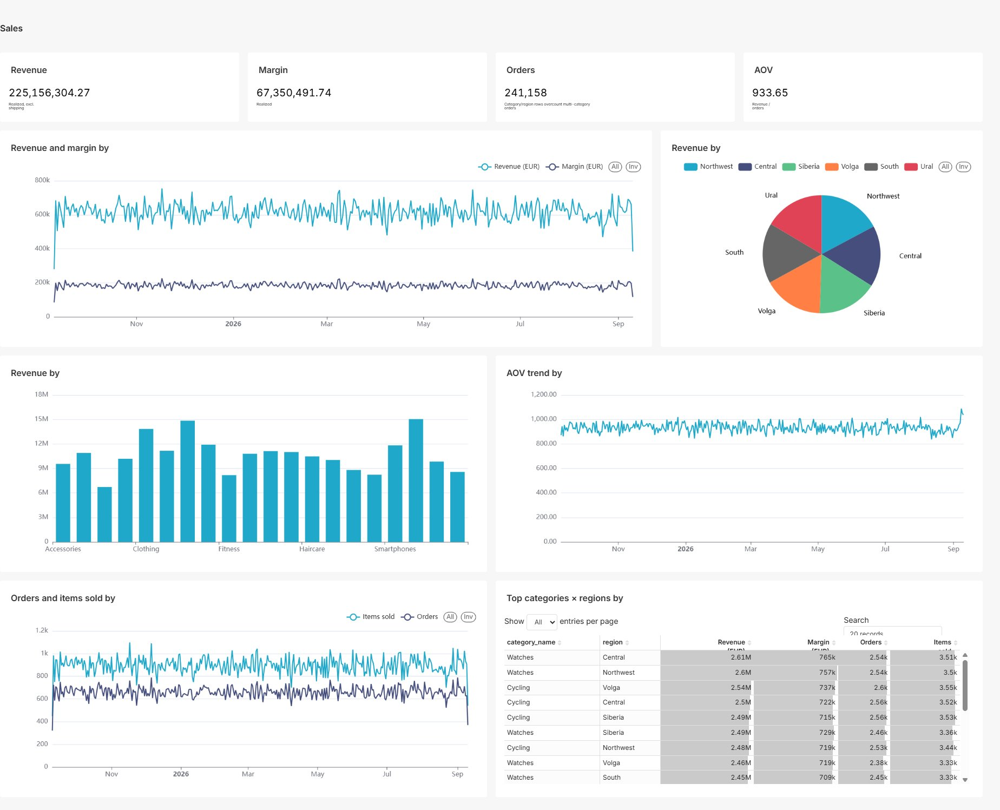
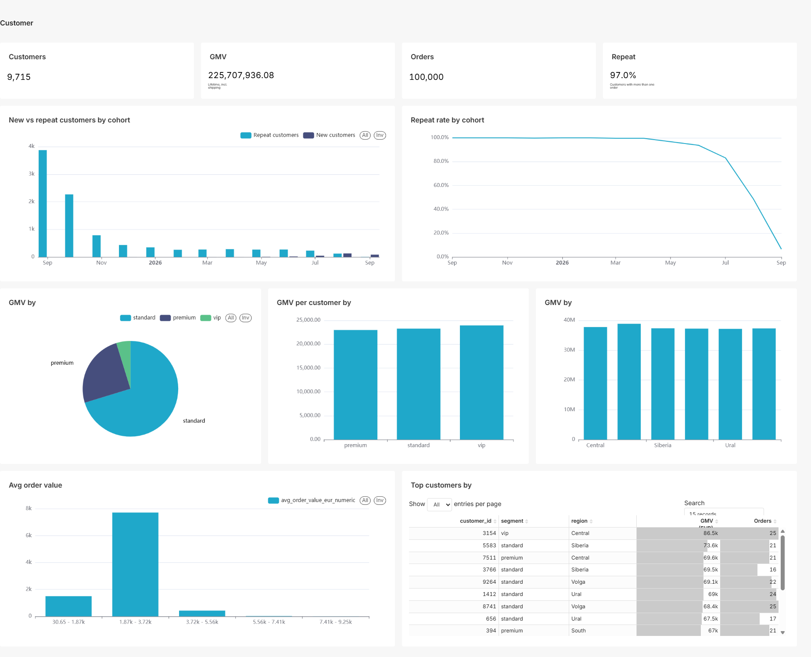
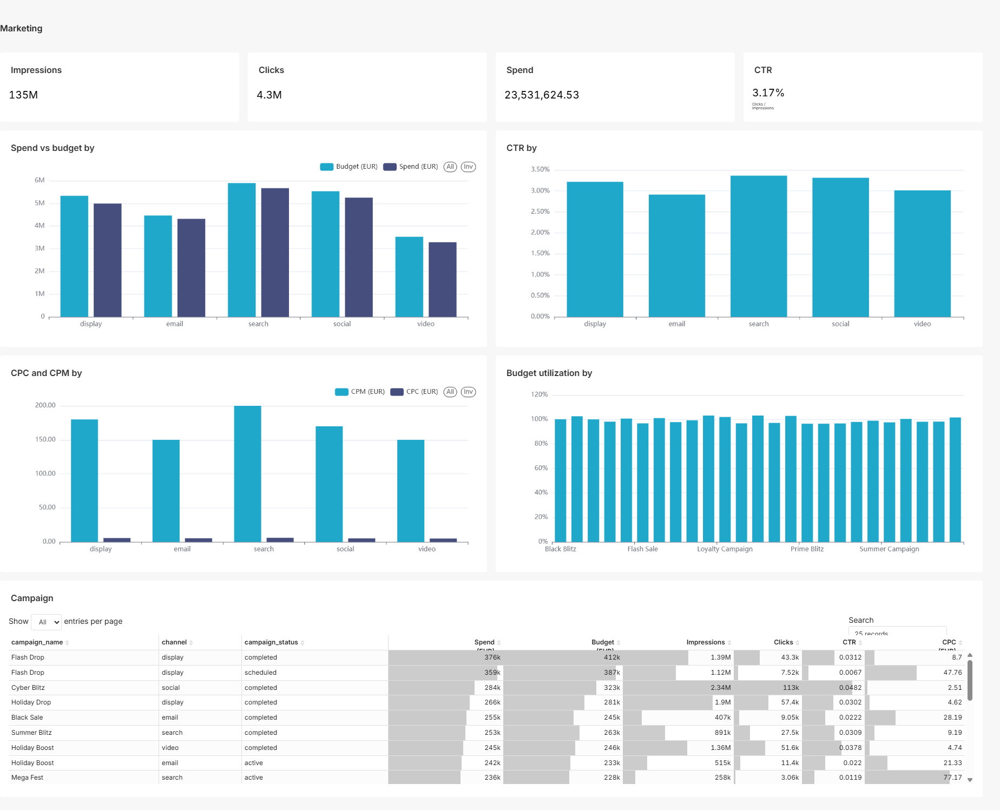

# OmniRetail Data Platform

A production-like educational data engineering capstone for a fictional
e-commerce company. OmniRetail combines batch ingestion and PostgreSQL CDC with
an Iceberg lakehouse, dbt dimensional modeling, Airflow orchestration,
ClickHouse serving, and Superset BI on a local Docker Compose stack.

**Status: Phase 8 capstone complete; maintenance-only.** Feature development
ends at the delivered Phase 0–8 scope. See
[ADR 0009](docs/adr/0009-freeze-capstone-scope-at-phase-8.md) and the
[completed roadmap](ROADMAP.md).

> This project is a production-like educational capstone, not a
> production-ready platform.

## Start here

Choose the depth that matches your goal; no duration estimate is implied.

| Level | Goal | Next step |
| --- | --- | --- |
| **Overview** | Understand the business problem, architecture, and delivered evidence | Continue with [What this project demonstrates](#what-this-project-demonstrates), [Implemented architecture](#implemented-architecture), and the [dashboard gallery](#dashboard-gallery) |
| **Code tour** | Follow each technology from problem to implementation, decision, and test | Use the guided [learning path](docs/learning-path.md#code-tour) |
| **Core demo** | Validate the Trino → Polaris → Iceberg → MinIO keystone | Follow the [Core demo](#core-demo) |
| **Full demo** | Trace a PostgreSQL mutation through CDC, dbt, ClickHouse, and Superset | Follow the [Full demo](docs/learning-path.md#full-demo) |



Clean-host infrastructure startup currently has a known MinIO image-supply
limitation. Read TD-001 in [PROGRESS.md](PROGRESS.md) before starting the Core or
Full demo; the Overview and Code tour remain usable without a live stack.

## What this project demonstrates

- **Heterogeneous batch ingestion** from PostgreSQL snapshots, paginated REST
  APIs, CSV, JSON, Parquet, and XLSX sources.
- **Restart-safe CDC** from PostgreSQL WAL through Debezium and Kafka into an
  insert-only Iceberg Bronze event table.
- **Lakehouse modeling** with MinIO, Apache Iceberg, Apache Polaris, Trino, and
  dbt staging/intermediate/core/mart layers.
- **CDC-aware analytics** with typed events, delete-aware current state,
  customer SCD Type 2, hard-delete handling, and recreate semantics.
- **Safe orchestration** with Airflow dataset triggers, bounded batch-Bronze
  snapshot expiration, and analytical refreshes pinned to a healthy, stable
  Kafka-offset boundary.
- **Rebuildable serving** through atomic full-snapshot publication from Iceberg
  Gold to ClickHouse.
- **BI as code** with sanitized Superset datasets and dashboards committed to
  the repository.
- **Engineering controls** including deterministic fixtures, idempotent paths,
  reconciliation tests, recovery runbooks, pinned dependencies, and CI.

## Business outputs

The delivered analytical layer supports:

- GMV, revenue, margin, orders, and AOV over time;
- sales and margin by category and region;
- customer LTV, new/repeat composition, and customer segments;
- delivery transit time and status mix by carrier;
- marketing spend, impressions, clicks, CTR, CPC, CPM, and budget utilization;
- order-to-payment reconciliation;
- analytical propagation of customer, order, and payment changes and deletes.

Clickstream funnel, conversion attribution, CAC, and ROAS are not claimed:
the required clickstream and attribution sources are intentionally outside this
repository's final scope.

## Implemented architecture



<details>
<summary>Text architecture fallback</summary>

```text
PostgreSQL snapshots / REST APIs / supplier files
  -> MinIO raw archive -> Bronze loader ----------------------┐
PostgreSQL WAL -> Debezium -> Kafka -> CDC consumer ----------┤
                                                              v
                                                        Iceberg Bronze
                                                              |
                                                        Trino + dbt
                                                              v
                                             typed Silver -> Gold -> marts
                                                              |
                                              atomic full-snapshot publish
                                                              v
                                                  ClickHouse -> Superset
```

Airflow orchestrates batch ingestion and the stable-boundary analytical refresh.
Polaris is the Iceberg REST catalog; Docker Compose profiles are the local
runtime; GitHub Actions provides CI.

</details>

### Component responsibilities

| Component | Responsibility | Implementation and evidence |
| --- | --- | --- |
| PostgreSQL | OLTP source with deterministic initial data and mutation workload | [Schema](postgres/init/01_oltp_schema.sql), [generator](src/omni_retail/generators/oltp/), [tests](tests/unit/generators/oltp/) |
| Python ingestion | API, file, snapshot, and Bronze-loading flows | [Ingestion package](src/omni_retail/ingestion/), [integration tests](tests/integration/) |
| Debezium | PostgreSQL WAL change capture for customers, orders, and payments | [Connector reconciler](infrastructure/scripts/debezium_connector_init.py), [ADR 0006](docs/adr/0006-cdc-deployment-and-delivery.md) |
| Kafka | Persistent CDC event transport | [Topic initialization](infrastructure/scripts/kafka_topics_init.sh), [CDC runbook](docs/runbooks/kafka-cdc.md) |
| CDC consumer | Restart-safe insertion of raw CDC events into Iceberg Bronze | [Consumer](src/omni_retail/streaming/cdc/consumer.py), [integration test](tests/integration/test_postgres_cdc.py) |
| MinIO | S3-compatible landing, archive, rejected, and lakehouse storage | [Compose runtime](docker-compose.yml), [object paths](src/omni_retail/ingestion/common/paths.py) |
| Iceberg | Analytical source of truth for Bronze, Silver, Gold, and marts | [Bronze loader](src/omni_retail/lakehouse/bronze/loader.py), [snapshot maintenance](src/omni_retail/lakehouse/snapshot_maintenance.py), [core smoke test](infrastructure/scripts/smoke_core.sh) |
| Polaris | Iceberg REST catalog | [Catalog initialization](infrastructure/scripts/polaris_init.py), [ADR 0001](docs/adr/0001-project-architecture.md) |
| Trino | SQL compute over Iceberg and Superset ad-hoc query path | [Iceberg catalog config](trino/etc/catalog/iceberg.properties), [benchmark](docs/benchmarks/phase6-trino-vs-clickhouse.md) |
| dbt Core | Typing, deduplication, SCD2, facts, dimensions, marts, and tests | [Models](dbt/models/), [model semantics](docs/data-model.md) |
| Airflow | Batch orchestration, batch-Bronze maintenance, and stable-boundary analytical refresh | [DAGs](airflow/dags/), [ADR 0008](docs/adr/0008-cdc-analytical-refresh-orchestration.md) |
| ClickHouse | Derived low-latency serving copy, rebuildable from Iceberg Gold | [Publisher](src/omni_retail/serving/clickhouse/publisher.py), [publication test](tests/integration/test_serving_publication.py) |
| Superset | BI dashboards through ClickHouse and ad-hoc SQL through Trino | [Asset guide](superset/README.md), [screenshots](docs/screenshots/README.md) |
| GitHub Actions | Lint, tests, offline dbt parse, Compose validation, and DAG tests | [CI workflow](.github/workflows/ci.yml), [testing model](#testing-and-ci) |

For a sequential reading route across these components, use the
[Code tour](docs/learning-path.md#code-tour).

Iceberg is the analytical source of truth. ClickHouse contains no unique
business state and can be rebuilt from Gold.

## End-to-end capstone flow

1. The deterministic generator creates an OLTP baseline in PostgreSQL.
2. Batch extractors preserve raw API, PostgreSQL snapshot, and supplier-file
   payloads in the MinIO archive and load manifest-backed sources into Iceberg
   Bronze.
3. Debezium captures customer, order, and payment mutations from PostgreSQL WAL
   and writes them to table-specific Kafka topics.
4. The CDC consumer writes raw events to Iceberg and commits Kafka offsets only
   after a successful Iceberg operation.
5. Airflow waits for healthy Debezium tasks, an active consumer, lag zero, and
   an unchanged exclusive high-watermark boundary.
6. dbt builds typed/delete-aware Silver state, Kimball Gold models, and four
   analytics marts at that exact boundary.
7. Critical dbt tests and business reconciliation must pass before publication.
8. The publisher loads complete mart snapshots into ClickHouse staging twins
   and atomically swaps them into service.
9. Superset reads the refreshed KPI state through a read-only ClickHouse user.
10. Re-running the same logical work converges without duplicate business data.

## Correctness and reliability design

- **Batch:** immutable raw payloads, logical-date paths, content-addressed file
  identity, canonical manifests, durable watermarks, checksum/count validation,
  idempotent Bronze loads, and machine-readable quarantine.
- **CDC:** a raw event ledger retains source and Kafka coordinates; PostgreSQL
  LSN plus within-topic offsets select state; duplicate delivery is a no-op;
  winning deletes remove current Gold keys without erasing history.
- **Refresh and serving:** Airflow freezes a stable Kafka frontier, dbt models
  and tests read that boundary, and ClickHouse uses staging twins plus atomic
  `EXCHANGE TABLES`; failed publication leaves the previous serving snapshot
  visible.

Detailed semantics and recovery procedures are in the
[data model](docs/data-model.md), [data contracts](docs/data-contracts.md),
[ADR index](docs/adr/README.md), and [runbook index](docs/runbooks/README.md).

## Dashboard gallery

Superset assets are committed as sanitized bundles under `superset/assets/`.
The delivered dashboards are:

- **Sales** — GMV/revenue/margin trends, AOV, category and region breakdowns;
- **Executive** — business KPI and delivery overview;
- **Customer** — acquisition cohorts, new/repeat mix, repeat rate, LTV, and top
  customers;
- **Marketing** — spend, budget utilization, CTR, CPC/CPM, and campaign
  scorecards.

### Sales



### Executive

The Executive dashboard preview appears in [Start here](#start-here).

### Customer



### Marketing



The reproducible capture procedure is documented in
[`docs/screenshots/README.md`](docs/screenshots/README.md).

## Local setup

### Prerequisites

- Linux or WSL2; the target workstation is Windows 11 + WSL2 with 32 GB RAM;
- Docker with Docker Compose;
- [`uv`](https://docs.astral.sh/uv/);
- `make`.

Recommended WSL2 allocation:

```ini
[wsl2]
memory=24GB
processors=6
swap=8GB
```

### Explore without services

A reader can validate the Python contracts and offline dbt project without
starting Docker Compose:

```bash
make setup
make test
make dbt-parse
```

These commands do not claim an end-to-end infrastructure check. Continue with
the [Code tour](docs/learning-path.md#code-tour) to trace representative files,
decisions, and tests.

### Core demo

#### One-time workstation setup

```bash
cp .env.example .env      # fill local values; never commit .env
make setup                # uv sync + pre-commit install
```

#### First-time data bootstrap

Use this sequence only for a new set of local volumes:

```bash
make up                   # core profile, health-gated
make generate-oltp        # strict deterministic initial load
make smoke-core           # Trino -> Polaris -> Iceberg -> MinIO
```

`generate-oltp` intentionally fails when any OLTP table is already populated;
that is a data-loss guard, not a failed routine restart. Its destructive
`--truncate-oltp-data` option is not a startup tool: truncating PostgreSQL must
be coordinated with the explicit CDC transport/Bronze recovery procedure in the
[Kafka/CDC runbook](docs/runbooks/kafka-cdc.md).

`make down` stops core services while preserving named volumes. `make reset` is
explicitly destructive and couples the PostgreSQL/core reset with Kafka/Connect
transport deletion so stale source offsets cannot survive a new source volume.
It preserves BI and Airflow metadata volumes but deletes MinIO/Iceberg data.

On a clean host, `make up` first builds the pinned MinIO server and client from
checksum-verified source commits, then starts the core profile. A cold build
needs access to GitHub source archives, pinned Docker base images, and the Go
modules locked by upstream `go.sum` files; repeated runs reuse BuildKit caches.
Compose never substitutes registry images for these local builds. Versions,
checksums, diagnostics, and the frozen update policy are documented in
[`infrastructure/minio/README.md`](infrastructure/minio/README.md).

### Compose profiles

The stack is intentionally profile-based so a 32 GB workstation does not need
to run every service continuously.

| Profile | Start command | Services |
| --- | --- | --- |
| Core | `make up` | PostgreSQL, MinIO, Polaris, Trino, mock API |
| Streaming | `make streaming-up` | Kafka, Debezium, CDC consumer |
| BI | `make bi-up` | ClickHouse, Superset, metadata/init services |
| Orchestration | `make airflow-up` | Airflow scheduler/webserver and metadata DB |

### Full demo

The guided Full demo—including the initial Debezium snapshot gate, a controlled
source mutation, a boundary-pinned Airflow refresh, and Superset observation—is
in the [learning path](docs/learning-path.md#full-demo).

With populated volumes, the routine environment restart is below. It is not the
first-time bootstrap path and intentionally does not rerun the strict loader:

```bash
make up
make streaming-up
make bi-up
make airflow-up
make streaming-status
```

An already populated OLTP source is the expected successful state for this
routine path. `make streaming-status` exits non-zero unless the connector, every
task, and the active CDC consumer are healthy; non-zero lag is displayed as
catch-up progress and is not by itself a service-health failure.

Before the first analytical refresh on a new CDC deployment, complete the
initial-snapshot gate in the
[Kafka/CDC runbook](docs/runbooks/kafka-cdc.md). Do not run manual dbt or
publication commands concurrently with `transform_lakehouse`.

### Representative commands

```bash
# Source data (generate-oltp is first-time-only and rejects populated tables)
make generate-oltp
make mutate-oltp EVENTS=300
make seed-supplier-files ROWS=500 SEED=11

# Raw ingestion
make ingest-files ARGS="--source supplier-prices --date 2026-09-11"
make ingest-api ARGS="run --source fx-rates --date 2026-09-10"
make ingest-api ARGS="backfill --source fx-rates --from 2026-09-01 --to 2026-09-10"

# Lakehouse
make bronze-load ARGS="run-new"
make iceberg-snapshot-plan ARGS="--table order_items"   # batch read-only
make iceberg-snapshot-expire ARGS="--table order_items" # batch explicit/irreversible
make iceberg-cdc-maintenance-plan                        # CDC read-only
make iceberg-cdc-maintenance-apply                       # CDC explicit/irreversible
make dbt-parse
make dbt-build
make dbt-test

# CDC
make streaming-status
make streaming-down       # preserves Kafka/Connect/slot/Bronze state
make streaming-reset      # destructive transport reset; clearly prompted

# Serving and BI
make serving-publish ARGS="--mart mart_daily_sales"
make serving-rebuild
make serving-benchmark

# Airflow
make airflow-test
make airflow-dag-test ARGS="transform_lakehouse 2026-09-18"
```

Use `make help` for the complete command list. Choose recovery procedures from
the [`docs/runbooks/` index](docs/runbooks/README.md).

## Analytical model

### Core dimensions and facts

- `dim_customer` — CDC-backed SCD Type 2 customer history;
- `dim_product`, `dim_date`, `dim_campaign`;
- `fact_orders`, `fact_payments` — CDC-backed current facts;
- `fact_order_items`, `fact_shipments` — snapshot-backed children gated by live
  CDC orders.

### Marts

- `mart_daily_sales` — date × category × region sales metrics;
- `mart_customer_ltv` — customer order, GMV, AOV, and segment metrics;
- `mart_marketing_roi` — campaign spend and engagement metrics; the historical
  table name is retained, but ROAS is not claimed without attribution data;
- `mart_delivery_performance` — carrier transit and status metrics.

Financial measures are normalized to EUR using order-date FX rates. Full grain,
key, and lifecycle semantics are in [`docs/data-model.md`](docs/data-model.md).

## Testing and CI

Local validation entry points:

```bash
make lint             # ruff check, format check, mypy
make test             # hermetic unit/contract tests
make dbt-parse        # offline dbt manifest validation
make airflow-test     # DAG pytest + import-error check in the Airflow image

docker compose config
make minio-build      # pinned, checksum-verified MinIO/mc source images
make smoke-core       # requires live core
make integration      # core required; absent optional profiles are skipped
```

`make integration` is opt-in and never starts or resets services. A healthy
core profile is mandatory. Streaming and BI checks run only when their host
endpoints are reachable; otherwise they report actionable skips. To execute
rather than skip every BI data check, prepare the normal Gold and serving state:

```bash
make up
make bi-up
make dbt-build
make serving-rebuild
make integration
```

Once an optional service is reachable, unhealthy responses, bad credentials,
incomplete bootstrap, query failures, permission regressions, and reconciliation
differences fail the suite rather than being converted into skips.

The integration suite uses disposable lakehouse schemas and exact-key rollback
journals rather than resetting shared schemas. Catalog-aware teardown retries
only recognized transient Trino/Polaris visibility failures with a finite
budget. Covered boundaries include:

- all four supplier-file formats and APIs through real MinIO;
- PostgreSQL snapshot lifecycle and watermarks;
- manifest-backed Bronze loading, partial-commit recovery, and idempotent reruns;
- disposable-schema batch and CDC maintenance with compaction, full-row
  preservation, idempotency, and retained time-travel history;
- dbt core build and business reconciliation;
- Debezium/Kafka CDC recovery and duplicate handling;
- Gold-to-ClickHouse publication and rebuildability;
- Superset bootstrap, ClickHouse canary, and Trino SQL Lab connectivity;
- dataset-triggered Bronze → dbt orchestration.

GitHub Actions runs ruff, pytest, non-blocking mypy, offline dbt parse, Docker
Compose validation, and Airflow DAG tests. It does not claim a hosted full-stack
integration environment.

## Performance evidence

The repository includes reproducible local evidence:

- [Phase 6 Trino vs ClickHouse benchmark](docs/benchmarks/phase6-trino-vs-clickhouse.md);
- [CDC clean-replay resource benchmark](docs/benchmarks/cdc-clean-replay.md);
- [CDC Iceberg maintenance benchmark](docs/benchmarks/cdc-maintenance.md).

The recorded numbers are local-workstation observations for bounded fixtures,
not general engine performance claims. The reports preserve workload,
measurement context, and reproduction commands.

## Repository layout

```text
src/omni_retail/    Python package: generators, ingestion, Bronze, CDC, serving
postgres/           Idempotent OLTP schema
trino/              Trino and Iceberg catalog configuration
dbt/                staging -> intermediate -> core -> marts
airflow/            DAGs, datasets, runners, policy, DAG tests
clickhouse/          Versioned serving migrations
superset/            Sanitized BI assets as code
infrastructure/      Custom images, bootstrap, smoke, and recovery scripts
tests/               Unit, contract, and opt-in integration tests
docs/                ADRs, model, contracts, runbooks, benchmarks, screenshots
```

## Documentation map

| Document | Purpose |
| --- | --- |
| [Learning path](docs/learning-path.md) | Overview, guided code tour, Core demo, and Full demo |
| [ROADMAP.md](ROADMAP.md) | Final Phase 0–8 scope, completed phases, and acceptance criteria |
| [PROGRESS.md](PROGRESS.md) | Current maintenance status and open technical debt |
| [Architecture ADRs](docs/adr/README.md) | Technology and lifecycle decisions, including the scope freeze |
| [Data model](docs/data-model.md) | Source/model grain, keys, CDC and SCD2 semantics |
| [Data contracts](docs/data-contracts.md) | Source and modeled-data contracts |
| [Runbook index](docs/runbooks/README.md) | CDC transport, batch/CDC Iceberg maintenance, Bronze rebuild, ClickHouse outage, Superset, and quarantine recovery |
| [Dashboard capture](docs/screenshots/README.md) | Manual screenshot procedure |
| [AGENTS.md](AGENTS.md) | Repository rules for coding agents |

## Known limitations and non-goals

Open debt is tracked in [PROGRESS.md](PROGRESS.md), not hidden by the capstone
label. Material limitations include:

- MinIO Community is frozen at the last project-validated source releases and
  receives no automatic updates; critical security or compatibility repairs
  remain manual maintenance;
- CDC compaction and snapshot retention are bounded and measured at the
  delivered 210,000-row workload; scale beyond that local fixture is not
  claimed;
- dbt model contracts are documented and tested but are not fully enforced by
  the current adapter;
- the local benchmark fixture is evidence of the method, not a scale claim;
- this repository does not provide production HA, disaster recovery, enterprise
  security controls, or managed-cloud deployment.

The following are intentional non-goals of this completed repository:

- clickstream processing and distributed sessionization;
- platform-wide metrics dashboards and automated lineage infrastructure;
- Data Vault as a second modeling domain;
- major runtime/platform migration exercises;
- Kubernetes or cloud infrastructure deployment.

Topic-focused continuation work is intentionally separated into independent
repositories in the same profile. Those projects have their own scope and are
not unfinished OmniRetail phases.

## Maintenance policy

Normal changes are limited to documentation, bug fixes, security/dependency
maintenance, and technical-debt resolution within the delivered architecture.
Adding a new service, feature domain, or previously excluded initiative requires
a new ADR that explicitly supersedes ADR 0009.
