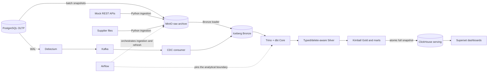

# OmniRetail Data Platform

A production-like educational data engineering capstone for a fictional
e-commerce company. OmniRetail implements a complete local data path from
batch and PostgreSQL CDC sources through an Iceberg lakehouse to ClickHouse and
Superset.

**Status: Phase 8 capstone complete; maintenance-only.** The project is not a
production-ready platform. Its final scope is defined by the
[completed roadmap](ROADMAP.md) and
[ADR 0009](docs/adr/0009-freeze-capstone-scope-at-phase-8.md).


## Highlights

- Heterogeneous batch ingestion from PostgreSQL snapshots, paginated REST APIs,
  CSV, JSON, Parquet, and XLSX sources.
- Restart-safe CDC from PostgreSQL WAL through Debezium and Kafka into an
  insert-only Iceberg Bronze event table.
- Typed and delete-aware Silver state, customer SCD Type 2, Kimball Gold models,
  and four business marts built with dbt and Trino.
- Airflow orchestration with dataset triggers, bounded Iceberg maintenance, and
  analytical refreshes pinned to a healthy Kafka-offset boundary.
- Atomic full-snapshot publication from Iceberg Gold to a rebuildable
  ClickHouse serving layer.
- Sanitized Superset datasets and dashboards committed as code.
- Deterministic fixtures, reconciliation tests, idempotent paths, recovery
  runbooks, pinned dependencies, and CI.

Choose a route through the project:

- [Code tour](docs/learning-path.md#code-tour) — connect each engineering
  problem to its implementation, decision, and tests.
- [Core demo](docs/learning-path.md#core-demo) — validate the
  Trino → Polaris → Iceberg → MinIO path.
- [Full demo](docs/learning-path.md#full-demo) — trace a PostgreSQL mutation
  through CDC, dbt, ClickHouse, and Superset.

## Implemented architecture



The architecture has three central invariants:

- **Iceberg is the analytical source of truth.**
- **ClickHouse is a derived serving layer rebuildable from Iceberg Gold.**
- **Airflow orchestrates execution; transformation SQL remains in dbt.**

Polaris provides the Iceberg REST catalog. Docker Compose profiles keep the
local stack usable on a single workstation. Follow the
[Code tour](docs/learning-path.md#code-tour) for component-level implementation
and executable evidence.

## Business outputs

The analytical layer supports:

- GMV, revenue, margin, orders, and AOV over time;
- sales and margin by category and region;
- customer LTV, new/repeat composition, and segments;
- delivery transit time and status mix by carrier;
- marketing spend, impressions, clicks, CTR, CPC, CPM, and budget utilization;
- order-to-payment reconciliation and propagation of CDC changes and deletes.

Clickstream funnels, conversion attribution, CAC, and ROAS are not claimed: the
required clickstream and attribution sources are outside the final scope.
Detailed grain, lifecycle, and metric semantics are documented in the
[data model](docs/data-model.md).

## End-to-end capstone flow

1. Python ingestion preserves batch payloads in MinIO and loads Iceberg Bronze.
2. Debezium and Kafka deliver PostgreSQL changes to the CDC Bronze ledger.
3. Airflow freezes a healthy Kafka boundary and runs dbt against it.
4. Tested Gold marts are atomically published to ClickHouse.
5. Superset reads the serving snapshot through a read-only account.

The [Full demo](docs/learning-path.md#full-demo) turns this flow into an
executable walkthrough.

## Reliability guarantees

- **Batch:** immutable raw payloads, logical-date paths, canonical manifests,
  checksums, durable watermarks, quarantine, and idempotent Bronze loads.
- **CDC:** source and Kafka coordinates are retained; offsets are committed only
  after successful Iceberg operations; duplicate delivery is a no-op; winning
  deletes are reflected without erasing raw history.
- **Refresh and serving:** dbt reads a stable Kafka frontier, critical tests and
  reconciliation gate publication, and ClickHouse switches complete snapshots
  atomically through staging twins.

Recovery procedures are indexed under [`docs/runbooks/`](docs/runbooks/README.md).

## Dashboard gallery

The delivered Superset assets are committed as sanitized bundles under
`superset/assets/`.

### Sales

GMV, revenue, margin, AOV, category, and region analysis.


### Executive

Business KPI and delivery overview.


### Customer

Acquisition cohorts, new/repeat mix, repeat rate, LTV, and top customers.


### Marketing

Spend, budget utilization, CTR, CPC/CPM, and campaign scorecards.


See the [capture procedure](docs/screenshots/README.md) for reproducible manual
updates.

## Local setup

Requirements: Linux or WSL2, Docker with Docker Compose, [`uv`](https://docs.astral.sh/uv/),
`make`, and approximately 24 GB of memory for the complete stack.

### Explore without services

Validate the Python contracts and offline dbt project without starting Docker
Compose:

```bash
make setup
make test
make dbt-parse
```

These commands do not claim an end-to-end infrastructure check. Continue with
the [Code tour](docs/learning-path.md#code-tour) to inspect representative
implementations and tests.

### Core demo

For a new set of local volumes:

```bash
cp .env.example .env      # fill local values; never commit .env
make setup                # uv sync + pre-commit install
make up                   # health-gated core profile
make generate-oltp        # strict deterministic initial load
make smoke-core           # Trino -> Polaris -> Iceberg -> MinIO
```

`make generate-oltp` intentionally rejects an already populated source.
`make reset` is destructive and is not part of a routine restart. MinIO is built
from pinned, checksum-verified source; versions and build diagnostics are in
[`infrastructure/minio/README.md`](infrastructure/minio/README.md).

For CDC, Airflow, ClickHouse, and Superset, follow the guided
[Full demo](docs/learning-path.md#full-demo). It includes the mandatory initial
Debezium snapshot gate and safe refresh sequence. Use `make help` for the full
command list and the [runbook index](docs/runbooks/README.md) for recovery.

## Validation and evidence

Primary validation entry points are:

```bash
make lint             # ruff, format check, mypy
make test             # hermetic unit and contract tests
make dbt-parse        # offline dbt manifest validation
make airflow-test     # DAG tests and import-error check

docker compose config
make smoke-core       # requires a live core profile
make integration      # opt-in; uses reachable live profiles
```

The integration suite covers batch sources, PostgreSQL snapshots, Bronze
loading and maintenance, dbt reconciliation, CDC recovery, ClickHouse
publication, Superset connectivity, and dataset-triggered orchestration. It uses
disposable schemas and targeted rollback rather than resetting shared data.
GitHub Actions runs the repository's static, unit, dbt parse, Compose, and DAG
checks; it does not claim a hosted full-stack environment.

Reproducible local performance evidence:

- [Trino vs ClickHouse serving benchmark](docs/benchmarks/phase6-trino-vs-clickhouse.md);
- [CDC clean-replay resource benchmark](docs/benchmarks/cdc-clean-replay.md);
- [CDC Iceberg maintenance benchmark](docs/benchmarks/cdc-maintenance.md).

Recorded numbers are bounded local-workstation observations, not general engine
performance or production-scale claims.

## Documentation

| Document | Purpose |
| --- | --- |
| [Learning path](docs/learning-path.md) | Guided code tour, Core demo, and Full demo |
| [Data model](docs/data-model.md) | Grain, keys, CDC ordering, SCD2, and mart semantics |
| [Data contracts](docs/data-contracts.md) | Source and modeled-data contracts |
| [Runbooks](docs/runbooks/README.md) | Recovery and operational procedures |
| [Architecture decisions](docs/adr/README.md) | Technology, delivery, and lifecycle decisions |
| [ROADMAP.md](ROADMAP.md) | Final scope and acceptance criteria |
| [PROGRESS.md](PROGRESS.md) | Current maintenance state and technical debt |

## Scope and limitations

This repository demonstrates production-like engineering practices but does not
provide production HA, disaster recovery, enterprise security controls,
managed-cloud deployment, or production-scale performance guarantees.
Additional disclosed limitations include the frozen MinIO Community source
baseline, bounded CDC maintenance measurements, and dbt contracts that are
documented and tested but not fully enforced by the current adapter.

Clickstream processing, platform-wide observability and lineage services,
alternate modeling domains, major platform migrations, Kubernetes, and cloud
infrastructure are intentional non-goals. Normal changes are limited to
documentation, bug fixes, security/dependency maintenance, and technical-debt
resolution inside the delivered architecture. Expanding that scope requires an
ADR that explicitly supersedes
[ADR 0009](docs/adr/0009-freeze-capstone-scope-at-phase-8.md).
